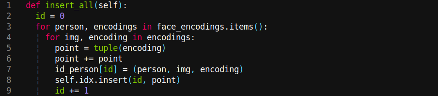

# Proyecto 3 - Base de Datos 2

## Integrantes

| Nombre y Apellidos |
|---|
|Diego Enciso Lozano |
|Luis Jauregui Vera	 |
|Alonso Barrios Silva|

## Tabla de contenido

"Clic para navegar: "

- [Introducción](#Introducción)
- [Fundamentos y descripción de las técnicas](#Fundamentos-y-descripción-de-las-técnicas)
- [Maldición de la dimensionalidad](#Maldición-de-la-dimensionalidad)
- [Resultados experimentales](#Resultados-experimentales)

## Introducción

Mediante este proyecto se busca entender y construir una estructura multidimensional óptima para dar soporte a las búsquedas y recuperación eficiente de imágenes mediante un servicio de reconocimiento facial.
Para ello, se implementa la búsqueda KNN y la búsqueda por rango, las cuales reciben como parámetro K elementos a recuperar y un radio de búsqueda respectivamente.
Para este proyecto se hizo uso de una colección de imágenes dadas por el profesor.

En este informe se muestra las comparaciones al usar queries con los mejores resultados.

## Fundamentos y descripción de las técnicas

### Backend

#### R-Tree

Lo primero que se hizo fue implementar el índice R-tree. Este tiene los siguientes métodos:

1.  Constructor

Lo más resaltante del constructor es que el árbol debe de tener una dimensión de 128, esto debido al tamaño del vector característico.

2. Extract features:

Este método se encarga de extraer los vectores característicos de cada una de las imágenes dadas.

**Descripción del código:** El segundo *for* (línea 6) se encarga de recorrer cada una de las imágenes de los archivos. Luego se encarga de procesar las imágenes. En el *if* de la línea 10 se encarga de comprobar que efectivamente haya mínimo un rostro en la imágen. Posteriormente, con ayuda de la librería *face_recognition* se extraen los vectores caraterísticos. Por último, se guarda el nombre de la imagen junto con sus vectores característicos en el diccionario *face_encodings*.

3. Insert all

Este método nos ayuda a extraer los datos más rápidamente, esto con el fin de poder mostrarlos sin necesidad de usar varias veces la estructura.

**Descripción del código:** Se recorre el diccionario *face_encodings* y se guarda los datos (nombre de la persona, ruta de la imagen, vector característico) en otro diccionario el cual tendrá como key un *id*. Finalmente, en el R-Tree se inserta el *id* y el punto, el cual es extraido en la línea 5 y en la línea siguiente duplica este punto debido a que está en 2 dimensiones.

4. Mindist

Este método se encarga de elegir la región con el que se tenga la misma distancia con respecto a la query.

**Descripción del código:** en las condicionales se corrobora que la sección que se evalua de la query no se encuentre dentro de la región, en ese caso este tomará el punto mínimo de la región (Lower) o el punto máximo (Upper); caso contrario este tomará el valor del punto donde se encuentra la sección evaluada. Por último hace el siguiente cálculo: 

  

5. Priority KNN

Este método se encarga de hacer la búsqueda por KNN.

**Descripción del código:** Primero se crea una lista llamada *heap*, luego se inicializa *min_distance* con el valor máximo de un *float* y también se inicializa *leaf_region*. Posteriormente, mediante un bucle se recorren las hojas del árbol y se elige la región en la que la mínima distancia entre esa hoja y el punto a evaluar sea la mínima. En el siguiente bucle se recorre punto por punto de la región obtenida, esto con el fin de poder recuperar la información de los puntos; luego se calcula la distancia euclidiana. Después, mediante el uso de las condicionales, si el tamaño del *heap* es menor que la cantidad de resultados que se quiere recuperar, este insertará los datos en un *max heap*; caso contrario, guarda el front y lo compara con la distancia calculada anteriormente y si cumple la condición dada (línea 18) este insertará el elemento en el *max heap* y elimina el elemento más distante. Finalmente, se ordena y se retorna el *heap*.

6. By range

Este método será el encargado de hacer la búsqueda por rango.

**Descripción del código:** 

#### Funciones extra

1. Clear files

Se encarga de eliminar los archivos creados en la ejecución anterior.

2. Euclidean distance 

Hace el cálculo de la distancia euclidiana.

3. Get img vector 

Extrae el vector característico de la query entregada en el frontend.

4. Sequential KNN

Hace una búsqueda secuencial KNN.

**Descripción del código:** Primeramente recorre los vectores característicos de las imágenes y les calcula la distancia euclidiana junto a la query dada. Por último, se ordena el resultado con respecto a la distancia y se retorna los k primeros elementos.

### Frontend

En cuanto al frontend, se utilizó el framework de VueJS. El programa le permitirá al usuario ingresar una imagen (preferiblemente con un rostro) y una cantidad de imágenes a recuperar. Al momento de terminar la búsqueda, este mostrará al usuario los K elementos con mayor coincidencia que se solicitó.

## Maldición de la dimensionalidad

Una de las mejores soluciones es usar la estructura X-tree, este evita el uso de ​ splits ​ el cual es encargado de traer un alto grado de ​ overlap ​ en el directorio. ​ Overlap ​ es el porcentaje del volumen que está cubierto por más de un hiperrectángulo en el directorio. 

El X-tree hace uso de supernodos, los cuales se encargan de extender el ​ block size ​ más de lo usual. Si bien esto puede sonar ineficiente debido a que es lineal; sin embargo, es más eficiente que hacer un alto ​ overlapping, el cual tiene que acceder a la mayoría de nodos secundarios durante la búsqueda, restándole eficiencia.

Otra de las característica de esta estructura es que hace un eficiente uso de la memoria principal disponible.

X-tree usa la eficiencia de la linealidad, explicado anteriormente, y la jerarquía de la estructura R-tree; este último para tener una mejor ​ performance ​ con los directorios que tengan menos dimensiones.

## Resultados experimentales
Para la parte experimental se comparó la eficiencia en tiempos de ejecución del KNN de la estructura RTree y el KNN secuencial para esto se incrementa el tamaño de las colecciones dadas (N).

# KNN Secuencial

# KNN-RTree Priority Queue

# KNN by range

  | Tiempo   | KNN-RTree (ms) 	 |  KNN-Secuencial (ms) |
  |:-------|:------------:|:----------------:|
  |  N = 100   |   8.045    |      6.919       |
  |  N = 200   |   5.462    |      12.321      |
  |  N = 400   |   4.436    |      24.210      |
  |  N = 800   |   10.244   |      47.087      |
  | N =  1600  |   12.784   |      93.925      |
  | N =  3200  |   16.875   |      177.118     |
  | N =  6400  |   29.476   |      371.881     |
  |N =   12800 |   48.769   |      824.421     |

**Discusión y Análisis:** Como se puede apreciar en el gráfico, mientras más colecciones dadas, el KNN-Secuencial va creciendo, mientras que el KNN-RTree no aumenta mucho su tiempo de ejecución. Este se debe a la estructura de arbol que este último utiliza. Sin embargo, según la tabla con pequeñas colecciones de datos, convendría usar el secuencial, pero hasta un aproximado de 100 colecciones. Cabe resaltar, que durante todo el proceso de ejecución del proyecto y en las pruebas, no hubo problema alguno en cuanto al tamaño de la dimensión de las imágenes (128) por lo que la única operación que toma minutos es la extracción de vectores característicos de cada una de las más de 13000 imágenes en el dataset, mientras que las búsquedas se ejecutan de manera eficiente y en tiempos muy rápidos menores a 1 segundo incluso cuando el tamaño de la colección tiende a su máximo valor.
